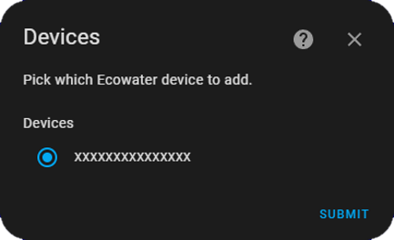
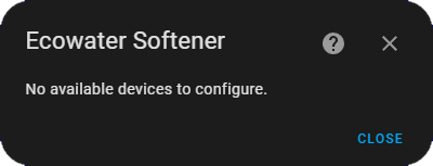
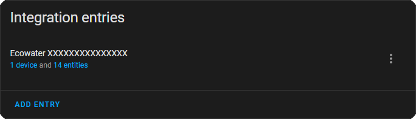
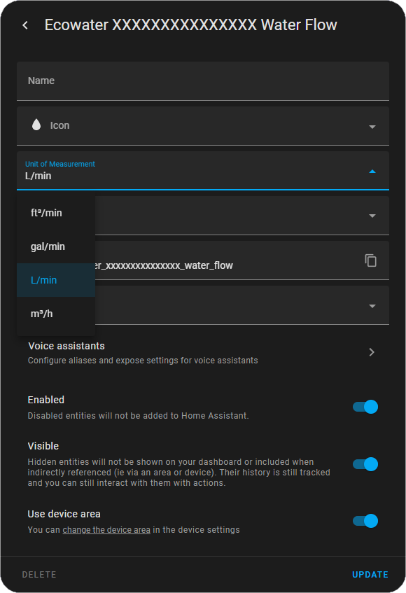

# **v4.0.0 BREAKING CHANGES**
**Entities have been removed and added in v4.0.0. You may have to remove your device from the integrations menu and re-add it.**

# Ecowater water softeners integration for Home Assistant

`ecowater_softener` is a _custom component_ for [Home Assistant](https://www.home-assistant.io/). The integration allows you to pull data from your Ecowater water softener.

## Installation

#### HACS
1. Go to `HACS`
1. Search for `Ecowater Softener` and add it to HACS
1. Restart Home Assistant
1. Go to `Settings > Devices & Services`
1. Click `+ Add Integration`
1. Search for `Ecowater Softener` and follow the configuration instructions

#### Manually
Copy the `custom_components/ecowater_softener` folder into the config folder.

## Configuration
To add an Ecowater water softener, go to `Configuration > Integrations` in the UI. Then click the `+` button and from the list of integrations select Ecowater Softener. You will then be prompted to enter the username and password for your Ecowater account.

After submitting your account login you will either be prompted to pick a device from your Ecowater account as shown below.

Or if you have already added all the devices in your Ecowater account you will recieve this error.

If the device is added successfully it should appear as shown.

This device will then have the entities show below.

## Changing Units

To change units select one of the entities and open the more info dialog and click the cog in the top right. This will bring up the settings for the entity. Then select `Unit of Measurement`, and a dropdown will appear where you can select the units you want.

## Credits
- [Maxime Princelle](https://github.com/ThePrincelle) - French Translations
- [Bastian](https://github.com/Quotic) - German Translations
- [@figorr](https://github.com/figorr) - Updated deprecated constants & Updated to using `await async_forward_entry_setups` & Updated regex
- [Kyle Johnson](https://github.com/kylejohnson) - Discovering and documenting the Ecowater API
- [Matt Galloway](https://github.com/mattjgalloway) - Sorting manifest.json ordering
- [@Tazmanian79](https://github.com/Tazmanian79) - Updating state class from measurement to total
- [Tom Cassady](https://github.com/heytcass) - Grammar fixes
-   [@rewardone](https://github.com/rewardone) for creating [ayla-iot-unofficial](https://github.com/rewardone/ayla-iot-unofficial) which is used to fetch the data
-   [Jeff Rescignano](https://github.com/JeffResc) for creating [sharkiq](https://github.com/JeffResc/sharkiq) which [ayla-iot-unofficial](https://github.com/rewardone/ayla-iot-unofficial) is based on.

## License
[MIT](https://choosealicense.com/licenses/mit/)
