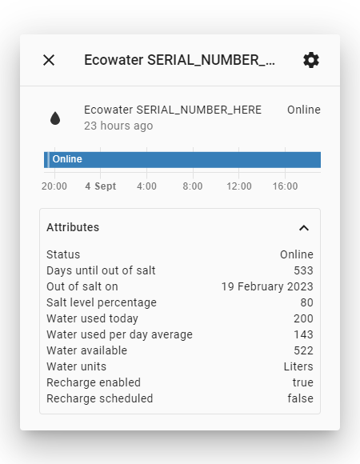
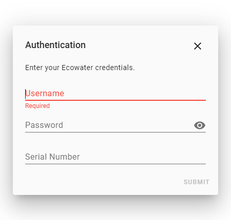

# Ecowater water softeners integration for Home Assistant

`ecowater_softener` is a _custom component_ for [Home Assistant](https://www.home-assistant.io/). The integration allows you to pull data from your Ecowater water softener.

It will create one sensor with multiple attributes.

## Installation

#### HACS

#### Manually
Copy the `custom_components/ecowater_softener` folder into the config folder.

## Configuration
To add an Ecowater water softener, go to Configuration > Integrations in the UI. Then click the + button and from the list of integrations select Ecowater Softener. You should then see a dialog like the one below.

You then need to enter the information you use to login on [https://www.wifi.ecowater.com/Site/Login](https://www.wifi.ecowater.com/Site/Login).

Then you will need to select the date format that your Ecowater device uses. You can check this under the `Out of Salt Date` and `Last Recharge` at [https://www.wifi.ecowater.com/Site/Login](https://www.wifi.ecowater.com/Site/Login).

This will then create an entity `sensor.ecowater_serialnumberhere`. This sensor will update every 30 minutes.

## License
[MIT](https://choosealicense.com/licenses/mit/)
