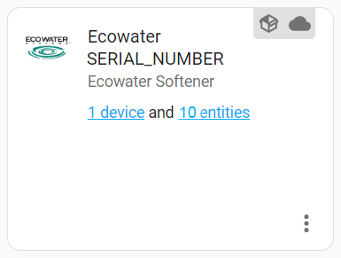
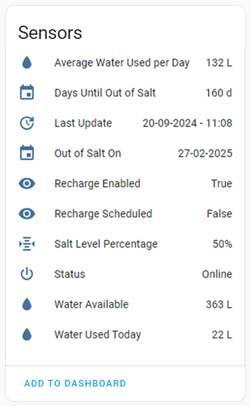

# **V3.0.0 BREAKING CHANGES**
**In version 3.0.0 the original sensor is discontinued. There are now individual entities for each piece of data. These new sensor also update every 10 minutes compared to the old sensor which updated every 30 minutes.**

**Before installing version 3.0.0 remove the integration from the "Device and Services" menu. Then install version 3.0.0 and restart before finally setting up the integration again.**

# Ecowater water softeners integration for Home Assistant

`ecowater_softener` is a _custom component_ for [Home Assistant](https://www.home-assistant.io/). The integration allows you to pull data from your Ecowater water softener.

## Current version: v3.4.1

## Changelog
Version 3.4.1
- Fixed invalid regex warning - Updated regex by @figorr

Version 3.4.0
- Updated to using await async_forward_entry_setups - by @figorr
- Grammar fixes - by @heytcass

Version 3.3.1
- New "last update" sensor: It retrieves the data and time the integration connects to the Ecowater server.
- Some minor changes. OUT OF SALT ON ... now gives the data d/m/Y instead Y/m/d when date format at setup is dd/mm/yyyy
- Update Readme file to show the current version and changelog.

## Installation

#### HACS
1. Go to HACS -> Integrations -> Click +
1. Search for "Ecowater Softener" and add it to HACS
1. Restart Home Assistant
1. Go to Settings -> Devices & Services -> Integrations -> Click +
1. Search for "Ecowater Softener" and follow the set up instructions

#### Manually
Copy the `custom_components/ecowater_softener` folder into the config folder.

## Configuration
To add an Ecowater water softener, go to Configuration > Integrations in the UI. Then click the + button and from the list of integrations select Ecowater Softener. You should then see a dialog like the one below.

You then need to enter the information you use to login on [https://wifi.ecowater.com/Site/Login](https://wifi.ecowater.com/Site/Login). (Serial Number = DSN)

Then you will need to select the date format that your Ecowater device uses. You can check this under the `Out of Salt Date` and `Last Recharge` at [https://wifi.ecowater.com/Site/Login](https://wifi.ecowater.com/Site/Login).

This will then create an device name "Ecowater SERIAL_NUMBER". 

This device will then have the entities show below.

## Credits

- [@ThePrincelle](https://github.com/ThePrincelle) - French Translations
- [@Quotic](https://github.com/Quotic) - German Translations
- [@figorr](https://github.com/figorr) - Updated deprecated constants & Updated to using `await async_forward_entry_setups` & Updated regex
- [@kylejohnson](https://github.com/kylejohnson) - Discovering and documenting the Ecowater API
- [@mattjgalloway](https://github.com/mattjgalloway) - Sorting manifest.json ordering
- [@Tazmanian79](https://github.com/Tazmanian79) - Updating state class from measurement to total
- [@heytcass](https://github.com/heytcass) - Grammar fixes

## License
[MIT](https://choosealicense.com/licenses/mit/)
